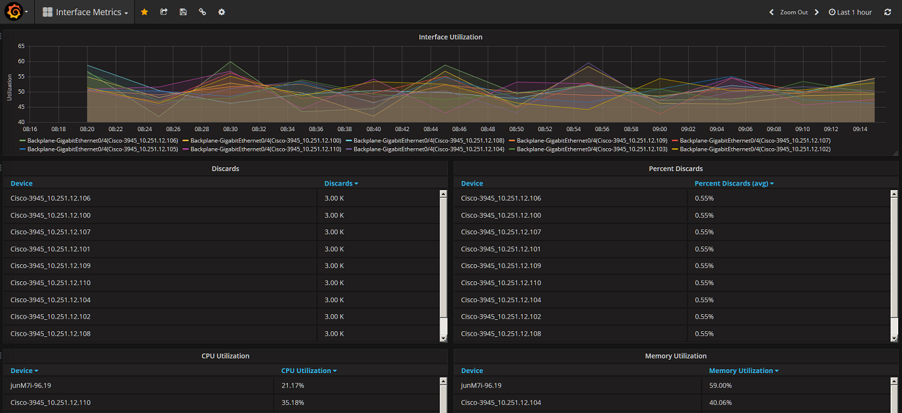

# OpenAPI-Grafana
A proof of concept example of a Grafana Datasource using Performance Center's OpenAPI, showing how OpenAPI can be used by other tools for importing and displaying Performance Center data.

# Use Case
This code provides a Grafana Datasource that can connect to OpenAPI using the Performance Center OpenAPI Proxy. It can generate Trend views and Top N table views

# Approach
Grafana Datasource with the following abilities
* uses CA PM OpenAPI to generate OpenAPI based views in Grafana
* Supports the Graph and Table views within grafana

# Prerequisites
CA PM 3.5. - This does not use any functionality specific to this version of Performance Center. No configuration changes or additional code is required for Performance Center.
Grafana v4.6.2 - The data source was developed and tested against this version of Grafana.

# Installation
See: http://docs.grafana.org/plugins/developing/development for information on manually installing a Grafana datasource
1. Download the master GIT repository on your workstation
2. Copy the grafana-openapi-datasource directory to the data/plugins directory on windows or the /var/lib/grafana/plugins on Linux systems 
3. Restart Grafana
4. Navigate to the Datasource administration in Grafana, and select "Add data source"
5. Select "OpenAPI Datasource" from the Type drop down
6. Enter the URL of the Performance Center system, i.e. http://pc_system.domain.com:8181
7. Select "Proxy", and the "Basic Auth" checkbox
8. Enter the username and password of a valid Performace Center user.
7. Click "Save & Test", It should connect successfully

# Notes
The app is provided as an example and no warranties are provided or made
* Currently supports one query per view in grafana
* Currently supports one variable per query in grafana
